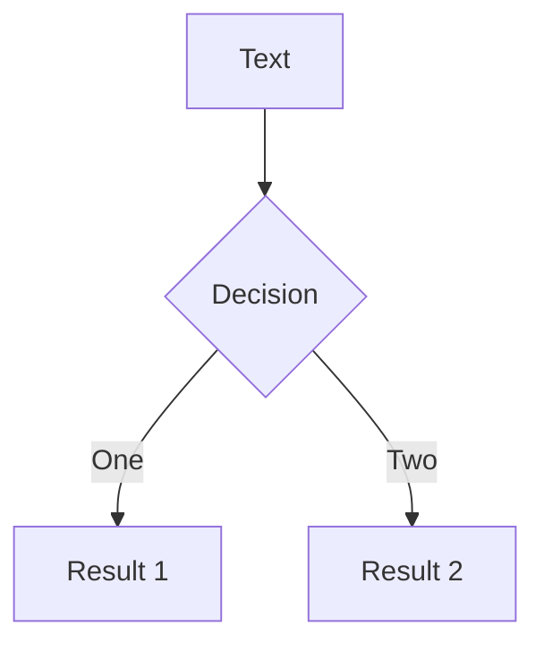

# Slidev 入门

## Markdown to slide

*academic theme*

---

<h1>Table of Contents</h1>
<br><br><br>
<Toc columns=2 maxDepth=2 />

<!-- https://cn.sli.dev/builtin/components.html#toc -->

<Footnotes v-after separator>
  <Footnote :number=0 >
  <a href="https://cn.sli.dev/builtin/components.html#toc">https://cn.sli.dev/builtin/components.html#toc</a>
  </Footnote>
</Footnotes>


---

# 安装


> https://cn.sli.dev/guide/install.html

```bash
npm init slidev@latest

cd slidev
```

AUR的`slidev-cli`用起来有问题，不建议用。

<br><br>

# 运行

> https://cn.sli.dev/guide/install.html#build-hostable-spa-single-page-application

```bash
npx slidev  # npx slidev slides.md
npx slidev build  # 从slides.md 生成网页
npx slidev export  # 从slides.md 导出 PDF
# vscode 使用 simple browser 打开 http://localhost:3030
```
---
layout: two-cols
---
<!-- asfsdafdasfasdffffffff -->
# 支持Markdown语法
1. 有序列表1
2. 有序列表2

<br>

- list1
- list2

<br>

`inline-code-block`

支持Latex公式: $E = M \times C^{2}$

$$
\begin{aligned}
3^{6n+3}+4^{6n+3} 
& \equiv (3^3)^{2n+1}+(4^3)^{2n+1}\\  
& \equiv 27^{2n+1}+64^{2n+1}\\  
& \equiv 27^{2n+1}+(-27)^{2n+1}\\ 
& \equiv 27^{2n+1}-27^{2n+1}\\
& \equiv 0 \pmod{91}\\
\end{aligned}
$$

::right::
<!--  -->
# 支持Mermaid



---
layout: two-cols

---
# 使用 vscode 编写slide

- vscode插件`slidev`，目前唯一作用是在markdown里显示分页，preview功能完全没用。[[2022年12月01日]]

- vscode插件`Markdown Paste`从剪切板导入附件，方便从截图直接导入。快捷键`ctrl + shift + v`。
建议如图进行设置。
```bash
${fileDirname}/public/${fileBasenameNoExtension}
```

**这是因为Slidev规定所有的静态资源都要放在`public/`目录下**

但是引用资源时，把`public/`视为根目录，类似``

**所有静态资源引用都必须`/`开头，否则导出时会报错。**

::right::


`vscode`里使用`simple browser`侧栏打开http://localhost:3030/

***********

~~为了解决相对路径的问题，将slides.md放到也放`public/`目录下，是个不错的方法~~。[2022年12月01日]BUG：slidev会卡死...因此不要把slides.md放到`public/`目录下😡😡😡😡。


<Footnotes separator x='r' >
  <Footnote :number=0 >
  <a href="https://gist.githubusercontent.com/Delta-in-hub/fb4e7603387eeb78a1ff97e70fee2b6d/raw/slidev.code-snippets"> slidev.code-snippets </a>
  </Footnote>
</Footnotes>

---
layout: two-cols
---


::right::

# 扉页

```yaml
---
theme: academic
class: text-white
coverAuthor: Delta
coverAuthorUrl: https://github.com/Delta-in-hub
coverBackgroundUrl: https://tvax2.sinaimg.cn/large/005uNPwHly1h8o7ap8yq0j31li12cdpn.jpg
coverBackgroundSource: unsplash
coverBackgroundSourceUrl: https://unsplash.com/photos/Rd9uwddKoRA
lineNumbers: true
download: true
themeConfig:
  paginationX: r
  paginationY: b
  paginationPagesDisabled: [1]
---
```

下载并使用主题`academic`。

并配置第一页的yaml即可。
---
layout: two-cols
---

# 引用图片
通过``这种方式没法控制图片的大小

因此要使用``


::right::

<br><br>

```css

```


---
layout: figure
figureCaption: 图片标题-Image title
figureUrl: /example.png
---

# layout: figure

但是
---
layout: figure
figureCaption: 图片标题-Image title
figureUrl: /example.png
hideInToc: true
---

# layout: figure
```yaml
---
layout: figure
figureCaption: 图片标题-Image title
figureUrl: /example.png
---
```
把图片挤跑了

怎么办？

---
hideInToc: true
---

# ~~layout: figure~~

```html
<p align="center">
  
  title
</p>
```
<p align="center">
  
  title
</p>
---
layout: figure-side
figureCaption: 图片标题-Image title
figureUrl: /example.png
figureX: 'l'
---

# layout: figure-side


```yaml
---
layout: figure-side
figureCaption: 图片标题-Image title
figureUrl: /example.png
figureX: 'l' # 'r'
---
```
---
layout: image
image: /example.png
---
# layout: image
```yaml
---
layout: image
image: /example.png
---
```

---
layout: center
class: "text-center"
---

# layout: center

This is the simple.
```yaml
---
layout: center  垂直居中
class: "text-center"   水平居中
---
```
---
layout: two-cols
---

# layout: two-cols


```yaml
---
layout: two-cols
---
```


::right::

# column 2


---
layout: center
class: text-center
---

# image in a row


```html


```

控制水平用`align`，控制垂直方向用`<br>`

---

# Footnote

Text with footnote<sup>1</sup>
<br><br><br>

```html
Text with footnote<sup>1</sup>

<br><br><br>
<Footnotes v-after separator>
  <Footnote :number=1 >
  <a href="">Footnote</a>
  </Footnote>
</Footnotes>
```


<Footnotes v-after separator>
  <Footnote :number=1 >
  <a href="">Footnote</a>
  </Footnote>
</Footnotes>

---
layout: two-cols
---
# 实在不行

控制精细的版式，要改css，`slidev`基于vue当然有这个能力，我认为太麻烦了。

要在Markdown的简洁和版式控制之间取得一个平衡，使用`yaml`加上适当的html ，比如`` 我可以接受这个程度。同时，配合vscode的snippets算是比较简单了。

当然实在不行，就在PPT里做然后截图，用`layout: image`
*******
`node_modules/@slidev/client/layouts/two-cols.vue `

Line32 改为`<div class="col-left" :class="props.class"  style="padding-right: 20px;">`


::right::

# layout

- two-cols
- figure-side
- center 
  - class: text-center
- image
- figure
> https://cn.sli.dev/builtin/layouts.html

<br>

***********

Line35 改为`<div class="col-right" :class="props.class"  style="padding-left: 20px;">`


不然两列文字贴在一起，看着难受😣。

---

# 导出PDF

`academic`这个主题导出PDF有bug，导出pdf时,页码会重叠在一起,因此要取消页码。以及脚注也会重叠在一起。

```yaml
---
themeConfig:
  paginationX: 
  paginationY: 
  paginationPagesDisabled: []
---
```

以及删除所有`<Footnotes >...`

```bash
npx slidev build slide.md --base=""
npx slidev export slide-pdf.md

# 生成的pdf放到 dist 文件夹并重命名为 slidev-exported.pdf
```